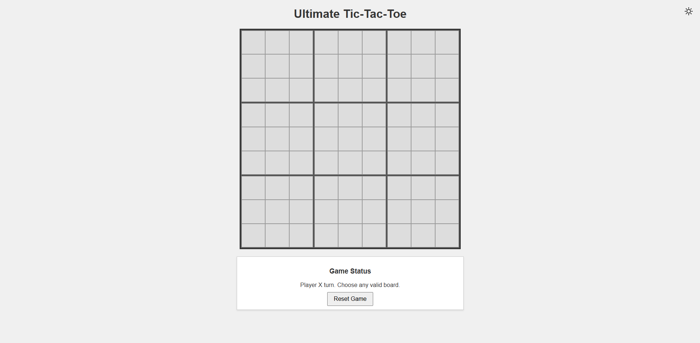

# Ultimate Tic-Tac-Toe (Web Edition)
A fully interactive web-based version of the classic Ultimate Tic-Tac-Toe game, built in C and compiled to WebAssembly using Emscripten. The entire project is containerized with Docker for a simple, one-command build and run experience.

<p align="center">
  
</p>

## Features
- **Interactive Graphical UI:** A clean, modern 9x9 grid built with HTML and CSS. No more terminal output!
- **Complete Game Logic:** Faithfully implements the rules of Ultimate Tic-Tac-Toe.
- **Next Board Highlighting:** The UI clearly highlights the required board for the next player's turn, making the game easy to follow.
- **Light & Dark Mode:** Includes a sleek theme switcher with sun and moon icons for user comfort.
- **Reset Functionality:** A "Reset Game" button to instantly start a new match.

## Getting Started
1. **Clone the Repository:**
```bash
git clone
```
2. **Navigate to the Project Directory:**
```bash
cd ultimate-tic-tac-toe
```
3. **Build the Docker Image:**
```bash
docker build -t ultimate-tic-tac-toe .
```
4. **Run the Docker Container:**
```bash
docker run -it -p 8000:8000 ultimate-tac-tac-toe
```
5. **Open Your Browser:**
Navigate to `http://localhost:8000` to play the game.

Or if you prefer the terminal version, you can run:
```bash
make
```

## Contributing
Contributions are welcome! Please fork the repository and submit a pull request with your changes.